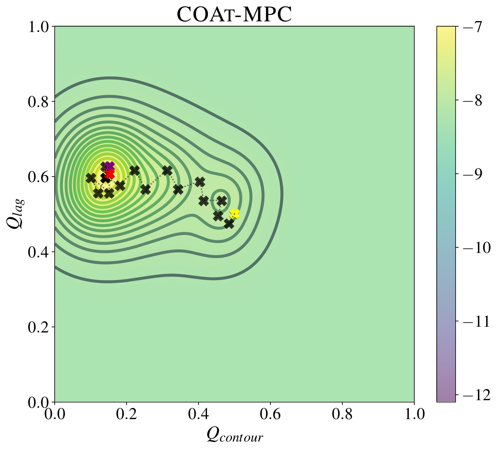
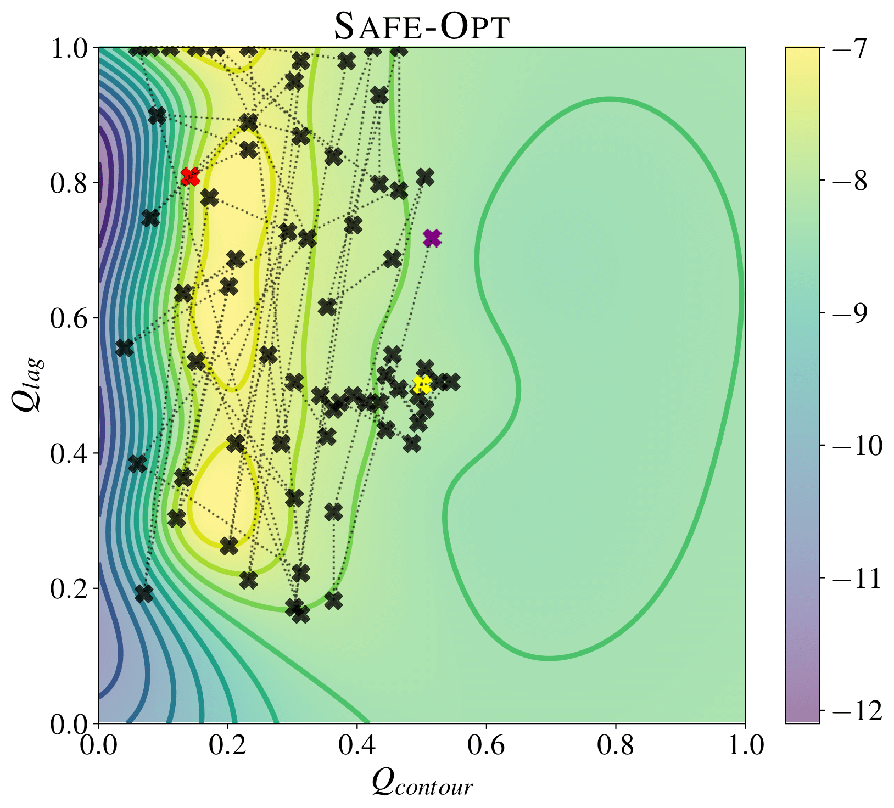
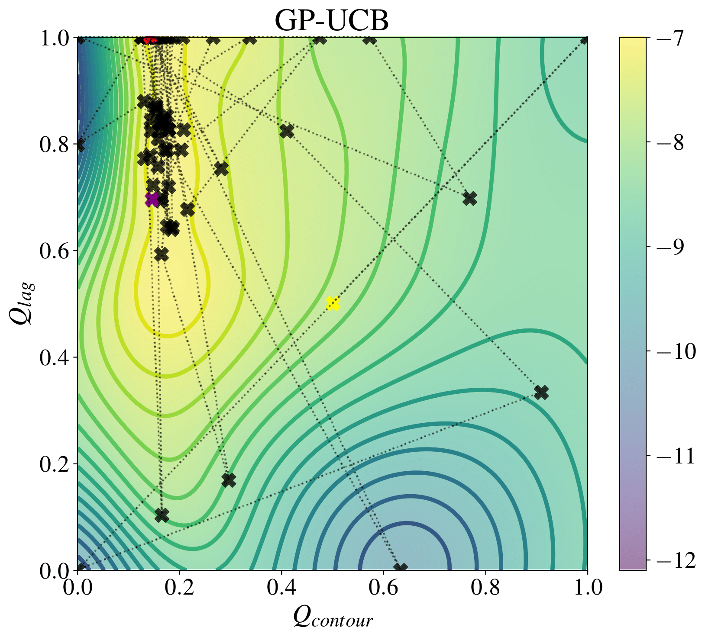
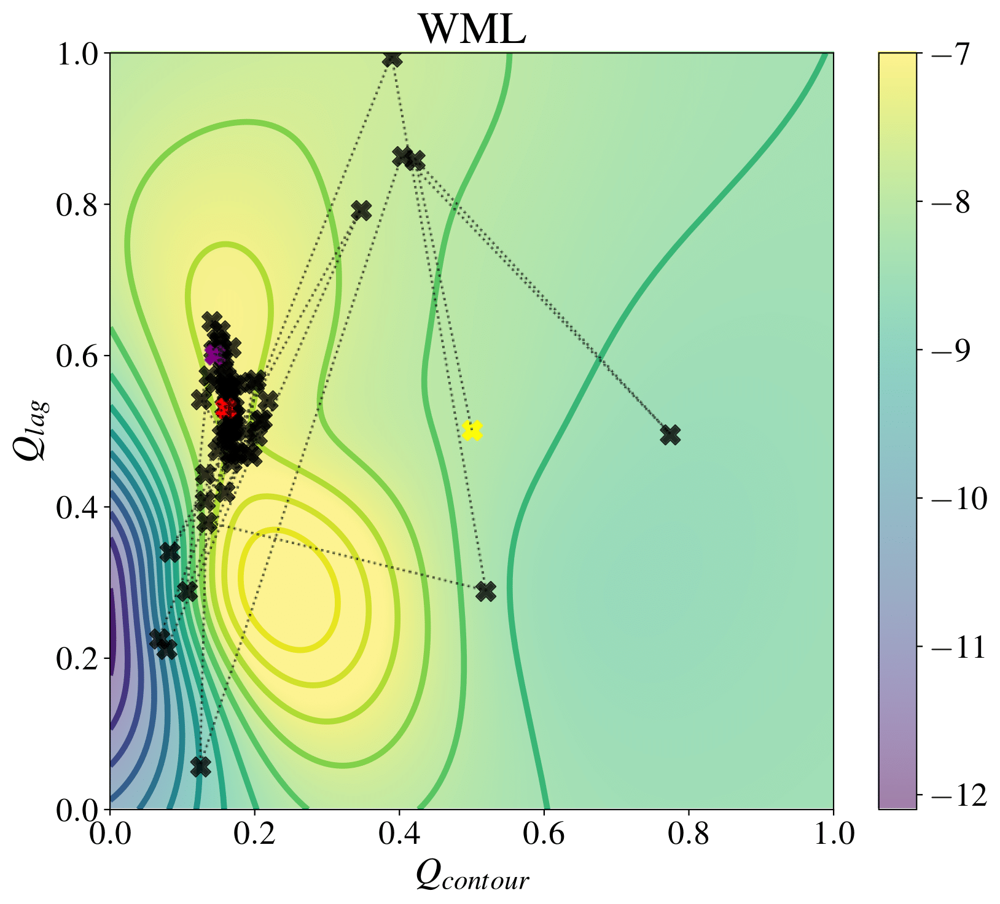

# COAt-MPC: Performance-driven Constrained Optimal Auto-Tuner for MPC

This repository contains a Python ROS library that implements Coat-MPC to tune the cost function weights of a Model Predictive Controller (MPC) for an autonomous system. The code uses ROS (Robot Operating System) to communicate with the MPC via dynamic reconfigure. The goal is to minimize the lap time while ensuring that it will always be below a certain threshold. The code of Coat-MPC reuses parts of the code os SafeOpt (https://github.com/befelix/SafeOpt). Furthermore, other methods such as Upper Confidence Bounds (UCB), Constrained Expected Improvement (EIC), Confidence Region BO (code resused from https://github.com/boschresearch/ConfidenceRegionBO), Weighted Maximum Likelihood (WML) and Metropolis-Hastings (MH). The pictures below show a comparison of the different algorithms tested on a real small-scale racing car.

<p align="center">
  
  
  
  
</p>

This library was developed and used to tune the cost function weights of [AMZ](https://www.amzracing.ch/en)'s driverless racing car.

Furthermore, it has been tested with a modified version of the  CRS framework: [Chronos and CRS: Design of a miniature car-like robot and a software
framework for single and multi-agent robotics and control](https://arxiv.org/pdf/2209.12048.pdf) . This framework includes an open source simulator, estimator and MPCC, besides many other functionalities. Code available here: https://gitlab.ethz.ch/ics/crs.

## Requirements
1. [ROS](https://wiki.ros.org/noetic) (Tested on version Noetic)

2. Python packages (see ```requirements.txt```)

3. This library assumes that the user has an MPC implementation with a [dynamic reconfigure](http://wiki.ros.org/dynamic_reconfigure) client that can be used to change its parameters in an online manner. For an MPCC implementation (no dynamic reconfigure) check https://github.com/alexliniger/MPCC or the CRS implementation.

4. This library assumes that racing simulator is available. The simulator or a trajectory optimizer must provide information about the track center. For a racing car simulator implementation check https://github.com/AMZ-Driverless/fssim or the CRS implementation.

5. This library assumes that the message [car_state](./coat_mpc_msgs/msg/car_state.msg) is sent by the MPC/state estimator.

6. All tests have been performed in an environment where the track is known beforehand (Trackdrive/Skidpad dissiplines in Formula Student Driverless). 

## Usage
1. Clone this repository
```bash
git clone https://github.com/albertgassol1/safeopt_mpc.git
```
2. Install python packages (Tested on Python 3.8.10)
```bash
pip install -r requirements.txt
```
3. Modify [config/interfaces.yaml](./coat_mpc_ros_interface/config/interfaces.yaml) with the correct ROS message names from your simulator, MPC controller and state estimator, and the simulator+MPC launch file name. 

4. Modify [config/tunable_weights.yaml](./coat_mpc_ros_interface/config/tunable_weights.yaml) with the MPC weights you want to tune. Include an initial set of values, upper and lower bounds and the MPC dynamic reconfigure server name. 
Make sure that the ROS environment is set up and that the ROS master is running.

5. Modify [config/config.yaml](./coat_mpc_ros_interface/config/config.yaml) with the desired optimization configuration. IMPORTANT: Add a rough estimate of the optimal lap time, a penalty time for cases where the MPC goes out of track (typically the average time*1.5), and the number of laps that you want to use for the optimization.

## Run the code

Include this package into your ROS workspace. Build everything and run:
```bash
roslaunch ros_cbo autotuner.launch
```

The code will start communicating with the MPC via dynamic reconfigure and start tuning the cost function weights.
The optimal laptimes and parameters will be saved in a folder inside [visualization/objects](./coat_mpc_ros_interface/visualization/).
After the maximum number of iterations, the optimal laptime and parameters will be printed in your terminal and the optimization will end.

The folder [visualization](./coat_mpc_ros_interface/visualization/) contains multiple scripts to visualize the performance of the algorithms. One can use the scripts to plot the cumulative regret over time as well as the posterior of the GP.

## Customization
The code can be easily customized to work with different MPCs and autonomous systems by changing the YAML files. In some cases, depending on your simulator you might need to change some lines of code.

## Notes

The code is set to use default parameters for the SafeOpt algorithm, which can be adjusted as needed in the [config/config.yaml](./coat_mpc_ros_interface/config/config.yaml) file.


## References

<a id="1">[1]</a> 
	Y. Sui, A. Gotovos, J. W. Burdick, and A. Krause. Safe exploration for optimization with Gaussian processes. ICML, 2015. Repo: https://github.com/befelix/SafeOpt

<a id="1">[2]</a> 
	A. Carron, S. Bodmer, L. Vogel, R. Zurbrügg, D. Helm, R. Rickenbach, S. Muntwiler, J. Sieber, and M. N. Zeilinger. Chronos and crs: Design of a miniature car-like robot and a software framework for single and multi-agent robotics and control. ICRA, 2023.

  <a id="1">[3]</a> 
	Lukas P. Frohlich and Melanie Nicole Zeilinger and Edgar D. Klenske. Chronos and crs: Cautious Bayesian Optimization for Efficient and Scalable Policy Search. CLDC, 2020.

## License
This code is released under the MIT License and free to use by anyone without any restrictions.

## Contact
For any questions or suggestions, please contact me at agassol@ethz.ch
